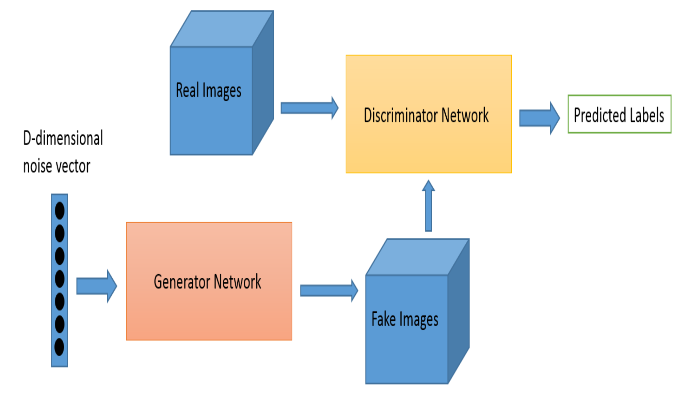

## 1. 서론
 &nbsp;&nbsp;흑백 이미지들은 주로 오래된 기록물, 콘텐츠 등에서 다뤄진다. 대한민국 역사를 담고 있는 1950~1980년대 이미지 또한 흑백 이미지가 대다수이다. 이러한 흑백 이미지에 컬러를 입히는 Colorization 기술을 통해 자료들을 복원하는 것은 사회적/경제적 가치 측면에서 매우 의미 있는 일이며, 이에 대한 need가 나타나고 있다. 

 

&nbsp;SKT AI Fellowship 4기의 과제 List 중 하나로 딥러닝 기반 흑백 이미지 컬러화 기술 개발이 선정되면서, 컬러화 기술 개발의 필요성을 실감하게 되어 대표적인 모델인 pix2pix으로 컬러화를 진행해보려 한다.

 &nbsp;cGAN(Conditional Generative Adversarial Networks)은 비지도학습인 GAN(Generative Adversarial Networks)의 한 종류이다. 2014년, Ian Goodfellow의 'Generative Adversarial Network'라는 논문에서 제안된 GAN은 진짜 데이터와 비슷한 데이터를 생성하는 Generator와 generator가 생성한 데이터를 판별하는 Discriminator로 구성되어 있다. Discriminator가 진짜 혹은 가짜 데이터인지 판별할 수 없는 경계를 GAN에서의 최적의 솔루션으로 간주한다. 이를 논문에서는 ‘경찰과 위조지폐범’을 예시로 들어 GAN 모델의 개념을 설명하고 있다. 
 
 &nbsp;cGAN은 지도학습으로 훈련 데이터가 라벨링되어 있어야 한다는 점과, 이를 통해 인위적으로 원하는 클래스의 데이터를 샘플링할 수 있다는 점이 GAN과 다르다. 

---

## 2. 데이터 셋
 Victorian400(kaggle)

---

## 3. 본론
&nbsp;GAN 구조, cGAN 구조, minmax problem

 
 

---

## 4. 결론

---

## 5. 참고문헌
